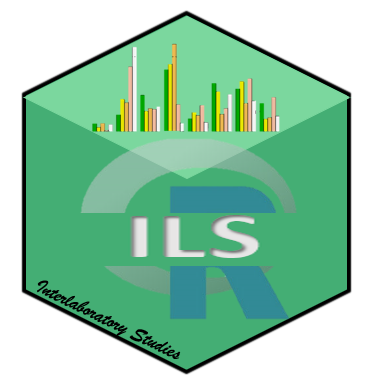

#  About ILS package  

<!-- badges: start -->

 
<!-- badges: end -->

The aim of the **ILS** package is to detect laboratories that provide not consistent results, working simultaneously with different test materials, from the perspective of the Univariate Data Analysis and the Functional Data Analysis (**FDA**).

The **ILS** package estimates the Mandel’s $h$ and $k$ univariate statistics, based on the **ASTM E691** and **ISO 5725-2** standards, to identify laboratories that provide significantly different results. $Cochran$ and $Grubbs$ tests to evaluate the presence of outliers are also available. In addition, Analysis of Variance (**ANOVA**) techniques are provided, including the Tukey and F tests to evaluate differences between the means for the corresponding test variable.

 One of the novelties of this package is the incorporation of tools to perform an **ILS** from a functional data analysis approach. Accordingly, the functional nature of the data obtained by experimental techniques corresponding to analytical chemistry, applied physics and engineering applications (spectra, thermograms, and sensor signals, among others) is taking into account by implementing the functional extensions of Mandel’s $h$ and $k$ statistics. For this purpose, the ILS package also estimates the functional statistics $H(t)$ and $K(t)$, as well as the $d_H$ y $d_K$ test statistic, which are used to evaluate the repeatability and reproducibility hypotheses where the critical $c_h$ and $c_k$ values are estimated by using a bootstrap algorithm.

##  References 

 Flores, M., Fernández-Casal, R., Naya, S., Tarrío-Saavedra, J., & Bossano, R. (2018). ILS: Un paquete R para análisis estadístico en estudios interlaboratorios. *Chemometrics and Intelligent Laboratory Systems* , **181** , 11-20,</pan>
[DOI](https://doi.org/10.1016/j.chemolab.2018.07.013) 

